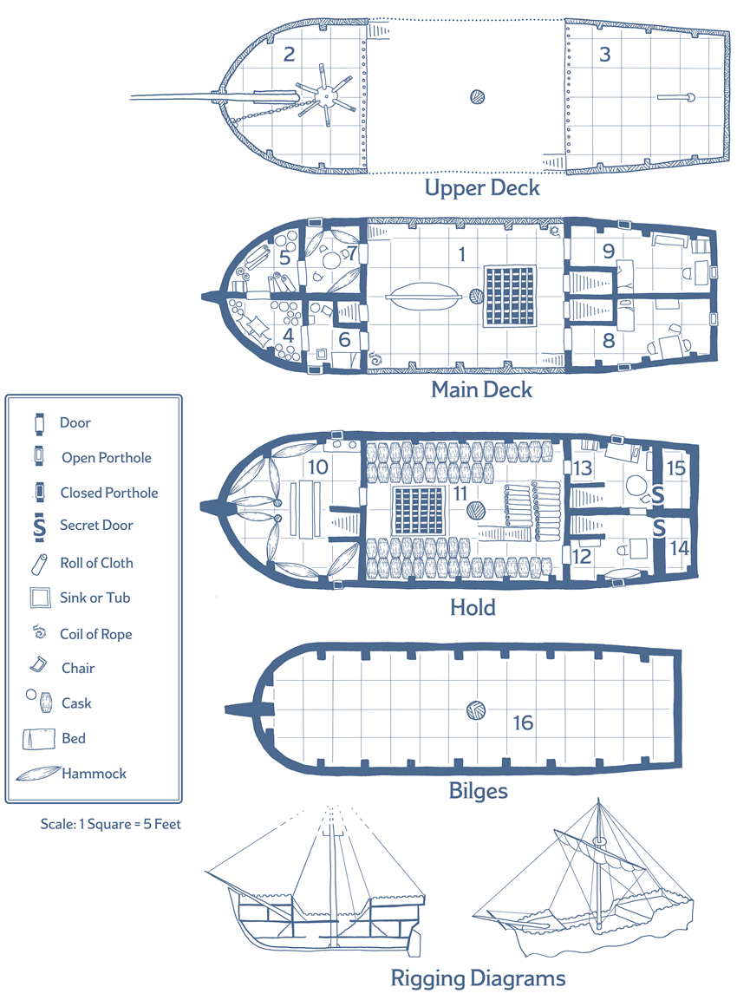

# A Chance Encounter

#session1 #seaghost

## Maps
Bilges
Hold
Main Deck
Upper Deck

## Enemies

Bloody Bjorn - Pirate First Mate
Foul Frithoff - Pirate Bosun
Punketah - Pirate Deck Wizard
7 Crew Members - Bandits
~~3 Lizardfolk~~

## Hook

`start in #14`
    14/15 are separated by iron bars
    
  `combine 12 and 15`

#OneEyedWilly - Real name Willam Ocenus (Ah-sea-nus) Sexy Pirate #accent, like Strahd but sailor-y. Sea elf.

Where did you come from?
    
> I be a member of the tribe of Manaan, we make our abode in an undersea settlement about twenty miles southeast of Saltmarsh.

How did you get here?

> We been noted, from a distance, the periodic travels of this vessel at night along a supposedly deserted coastal area. We got suspicious of this behavior, and I was ordered to scout out the ship, slip aboard, and follow the ship back to port

> Arr, this I did and at port I saw the crew stow a small arsenal of weaponry. Next thing I know I woke up here chained up with a bump on me head and one eye missing.

Where are they taking us?

> Arr, I expect they be taking us as slaves to the hold of the sea princes